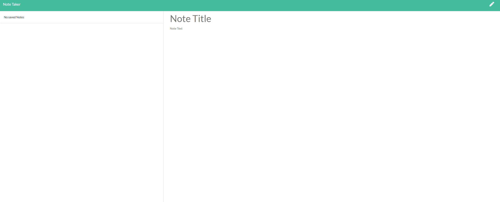

# noteTakers

## Description
For users that need to keep track of a lot of information, it's easy to forget or be unable to recall something important. Being able to take persistent notes allows users to have written information available when needed.

### Example gif

### Example of Finished work

## Table of contents
- [Description](#Description)
- [Installation](#Installation)
- [Usage](#Usage)
- [Licence](#Licence)
- [Contributors](#Contributors)
- [Test](#Test)
- [Repository Link](#Repository)
- [GitHub Info](#GitHub)
## Installation
  Run:

        npm i
        
## Usage
This will start up the server in your favorite terminal:

        node server.js

## Licence

## Contributors
Just me Jordan Kirby
## Test
jest was used
## Repository
- [Note Takers](https://github.com/Feizhi255/noteTakers)
## GitHub

- Jordan Kirby
- [Feizhi255](https://github.com/Feizhi255)
## Questions? send me an email
- <jrock255@hotmail.com>